# **OBC**

## --------------------------------------------------------------------------------------------

# 板子启动流程：

```
上电 → ROM code → 读取启动头 → 加载 SPL → SPL 初始化DDR → U-Boot  → kernel → rootfs → 启动用户空间init 进程
```


- - #### 第一阶段：物理链路初始化

    1. **ROM Code**：上电第一个动作，从存储介质读取 idbloader.img。
    2. **TPL (Tiny Program Loader)**：在 SRAM 运行。**核心任务：初始化 DDR**（此时内存才可用）。
    3. **SPL (Secondary Program Loader)**：由 TPL 加载。任务是把后面的“三剑客”拉进 DDR：**ATF、U-Boot、DTB**。

    #### 第二阶段：权限与安全切换（ARMv8 的精髓）

    1. **ATF (BL31)**：**这是系统当前的最高统治者（EL3权限）**。
       - 它初始化 **PSCI**（电源状态协调接口）。
       - **面试加分点**：它提供电源管理服务，以后内核想关核、调频都要通过 smc 指令求助 ATF。
       - **降权动作**：ATF 准备好后，执行上下文切换，将 CPU 降级到 **EL2** 权限，然后跳转到 U-Boot。

    #### 第三阶段：系统引导

    1. **U-Boot (BL33)**：运行在 **EL2**。
       - 解析 bootcmd，从 EMMC 分区把 **Image**（内核）和 **DTB** 搬到 DDR 指定位置。
       - **跳转动作**：将 DTB 地址存入 **X0**，执行 **booti**，将权限降级到 **EL1** 进入内核。

    #### 第四阶段：内核与用户态

    1. **Kernel**：运行在 **EL1**。
       - 开启 **MMU**（虚拟内存管理）。
       - 初始化 GIC（中断控制器）、时钟、GPIO 驱动。
       - 解析设备树节点，匹配各路驱动。
    2. **Rootfs & User Task**：内核挂载根文件系统。
       - 启动第一个用户进程 init，进入运行在 **EL0** 的用户态任务。


### 关于uboot阶段细节

（**bootcmd**：是给 **U-Boot** 用的。它规定了 U-Boot **如何把内核跑起来**（比如去哪读文件、读到哪）。

**bootargs**：是给 **Linux 内核** 用的。它规定了内核 **启动后的行为**（比如控制台串口是谁、根文件系统在哪、内存限制多少）。它告诉内核的是eMMC上的地址和大小，需要与我们当时烧录时候的地址分布一致

举例：bootargs console=ttymxc0,115200 root=/dev/mmcblk1p5 rootwait rw blkdevparts=mmcblk1:512K@0x80000(fdt0),512K@0x100000(fdt1),16M@0x200000(kernel0),16M@0x1200000(kernel1),64M@0x2200000(rootfs0),

64M@0x6200000(rootfs1),64M@0xa200000(appfs0),64M@0xe200000(appfs1)

1.console=ttymxc0,115200  ---> 告诉使用ttymxc0串口 波特率为115200

2.root=/dev/mmcblk1p5 --->当前主系统为rootfs1

3.rootwait ---->等待指令

4.rw  读写权限

5.blkdevparts=mmcblk1:  ------>告诉内核第1号 eMMC 设备里地址分区的情况

### 两套系统 （作用1.如果主系统（A）崩了，备份系统（B）立刻顶上 2.在线升级后 (版本交替) 

**套装 A**：fdt0 + kernel0 + rootfs0

**套装 B**：fdt1 + kernel1 + rootfs1


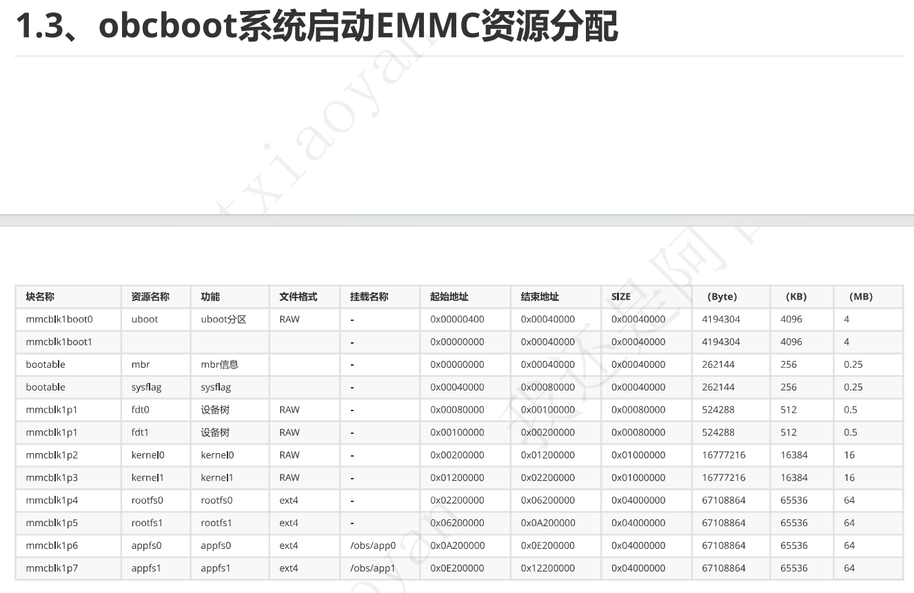


2025.11-2026.03 

RK3566 嵌入式系统框架（OBC）设计与实现

项目描述：针对工业级 RK3566 平台，设计并实现了一套高可靠、低时延的嵌入式系统引导框架，核心解决启动时序优化、固件原子

升级、硬件抽象解耦等遇到的实际问题。

技术栈：U-Boot、DTB、eMMC 、Buildroot、TFTP 协议栈

工作内容：

● 通过存储介质分层策略（SD->eMMC），结合 U-Boot 子系统级裁剪（移除 USB/PCIE/DM 驱动栈），将冷启动时序从 5.6s 压缩2.3s（优化 59%）

***\*如何知道需要裁剪哪些？？\**** 

看总体make uboot_menuconfig 看看哪些功能没有用到

或者简单粗暴一点 看哪个功能去掉之后会导致起不来 会导致起不来的就保留

***\*如何测定这个时间？？\**** log 、gpio

● 设计设备树驱动的动态分区映射层，在引导阶段解析 DTB 分区节点，实现分区布局的运行时动态重构，实现修改分区无需重编Bootloader 工程化目标

通过obc_blk_read_part_by_name函数从设备树获取地址

●  构建覆盖 FDT/Kernel/RootFS 的全镜像 A/B 双分区升级体系，适配现场 OTA 场景

把地址分割为，通过sysflag的start_part配合iPartType的iPartType，实现双分区切换

特别注意的是，fdt需要额外写，因为这个地址是我们定死的，其他的地址都得从这里拿来

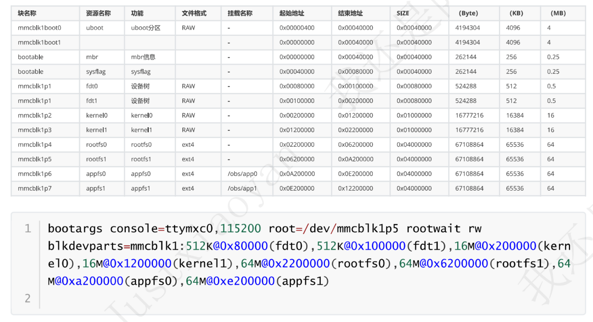

● 定义 512 字节私有协议头（魔数识别 + CRC32 校验）实现镜像完整性闭环验证

D:\OBC_Code-master\2-Imx6ull-Board\obc-1.0.0\tools\pack_tools\pack\pack.c文件里，我为镜像设计了一套 512 字节的私有封装协议，通过 Magic 识别和 CRC32 校验实现了镜像的一站式合法性与完整性验证。通过扇区对齐设计，优化了 U-Boot 阶段的解包效率，有效规避了 EMMC 烧录过程中的静默数据损坏风险。”

***\*为什么是512字节？\**** 因为一个扇区是512字节

● 设计并实现具备掉电保护能力的升级状态机，结合 A/B 冗余分区 建立自动回滚机制，确保异常中断后可自愈恢复

***\*掉电保护能力的升级状态机\*******\*：\****掉电安全的状态机管理：升级时，数据写入非活跃分区（B区）。在此过程中，即使断电，活跃分区（A区）的数据依然完好无损。

***\*自动回滚机制：\****有一个全局的计数sysflag，板子启动的时候先把计数+1，在每个可能失败的地方判断，若失败则进入panic，emergency_restart重启，在uboot启动时加入判断，这个全局计数若大于等于3，则修改sysflag，计数器清零，换分区启动 （使用看门狗watchdog来兜底 防止panic无法重启的情况

 

 

bootcmd和bootargs是如何联动发挥作用的？？可是这些分区信息不是要在bootargs里面指定吗？？那么在拉入DDR之前 bootcmd如何从设备树里知道分区信息？

bootcmd运行之前，我们会定死FDT在EMMC里的地址，所以才能FDT拉到DDR指定位置，然后通过FDT解析出kernel在EMMC里的地址，加载到DDR里

而bootargs是用来uboot给kernel的信息描述

 

 

我在menu里修改的宏 会体现在哪个defconfig里？？？

当你点击 Save 退出 menuconfig 时，所有的改动都会保存在 U-Boot 源码根目录下的一个隐藏文件：.config 中。

证据： 你可以执行 grep "CONFIG_NET" .config 看到你刚才的改动。

注意： 这个文件是临时的。如果你执行了 make distclean，这个 .config 就会被删掉，你的改动也就丢了。

2. 它不会自动回到 defconfig

configs/mx6ull_14x14_evk_defconfig 是一个静态模版。

make xxx_defconfig 的过程是：模版 -> .config（单向）。

make menuconfig 的过程是：修改 .config。

结论： 除非你手动操作，否则 configs/ 里的原始文件永远不会变。

 

 

烧录流程：

1. 编译出uboot zImage fdt rootfs
2. Sudo umount /dev/sdb1  //解除挂载
3. sudo dd if=/dev/zero of=/dev/sdc bs=1M count=10 conv=fsync //清理头部 
4. sudo dd if=u-boot-dtb.imx of=/dev/sdc bs=1k seek=1 oflag=direct  //保证dd烧到TF卡里1K偏移 bs=1k -->  定义块大小，一块是1k  seek=1 ---> 从第一块开始，跳过了第0块

5.从TF卡启动，但是卡在网络 

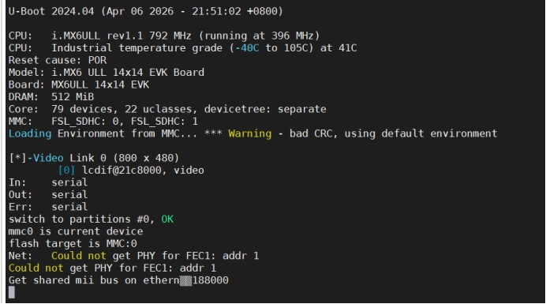 

解决办法：make uboot_menuconfig 把 Net关闭  先屏蔽网络

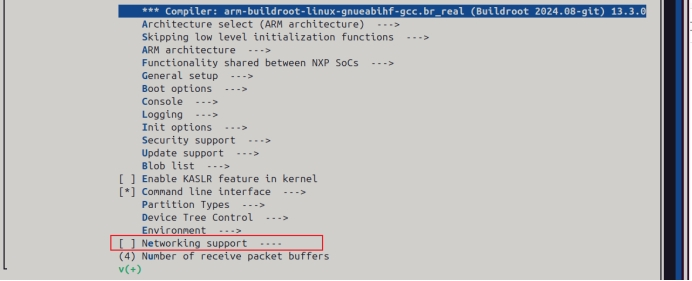 

出现问题：修改的menu会被覆盖掉

在makefile里把方块里的加上 不然编译的不对 系统默认回去找之前的defconfig

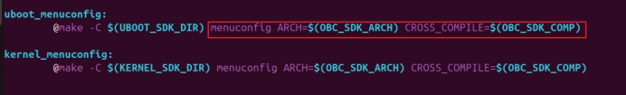 

 

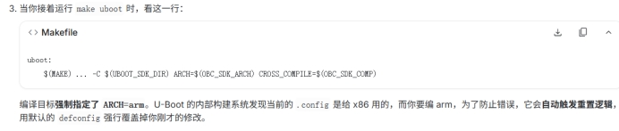 

 

 

=> mmc list

FSL_SDHC: 0 (SD)

FSL_SDHC: 1

=> mmc dev 1

switch to partitions #0, OK

mmc1(part 0) is current device

=> mmc info

Device: FSL_SDHC

Manufacturer ID: 1

OEM: 0

Name: S40004

Bus Speed: 49500000

Mode: MMC High Speed (52MHz)

Rd Block Len: 512

MMC version 5.1

High Capacity: Yes

Capacity: 3.6 GiB

Bus Width: 4-bit

Erase Group Size: 512 KiB

HC WP Group Size: 8 MiB

User Capacity: 3.6 GiB WRREL

Boot Capacity: 4 MiB ENH

RPMB Capacity: 4 MiB ENH

Boot area 0 is not write protected

Boot area 1 is not write protected

=> updatex dev 1

set up dev 1

=> upfdt

ethernet@20b4000 Waiting for PHY auto negotiation to complete......................................... TIMEOUT !

Could not initialize PHY ethernet@20b4000

Using ethernet@20b4000 device

TFTP from server 10.10.0.201; our IP address is 10.10.0.221

Filename 'fdt.dtb'.

Load address: 0x84000000

Loading: *

ARP Retry count exceeded; starting again

Failed to get file size

updatex up get file failed ret -1

upfdt failed -1

=> updatex dev 1

set up dev 1

=> upfdt //网口已经配置好 还差ip地址

ethernet@20b4000 Waiting for PHY auto negotiation to complete..................... done

Using ethernet@20b4000 device

TFTP from server 10.10.0.201; our IP address is 10.10.0.221

Filename 'fdt.dtb'.

Load address: 0x84000000

Loading: *

ARP Retry count exceeded; starting again

Failed to get file size

updatex up get file failed ret -1

upfdt failed -1

 

 

该defconfig文件在make之后会强制重命名并覆盖到 U-Boot 源码目录下的 .config

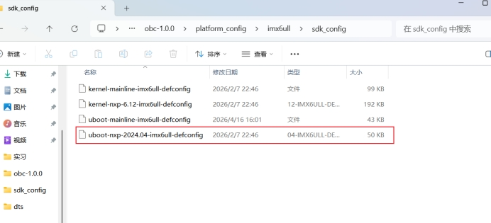 

等于make platform之后 会把.config重置 相当于回复出厂设置了 （因为defconfig是静态的，menuconfig只能修改到.config

 

先通过menuconfig关闭Net，进入终端，然后修改dts，把上面的defconfig覆盖我的defconfig一下，然后重新make platform，把defconfig覆盖到.config，就能带着网进入终端，现在只需解决ip问题即可

 

出现问题：编译出来的uboot是正确的，但是烧录到TF里，发现还是老的uboot，为什么？

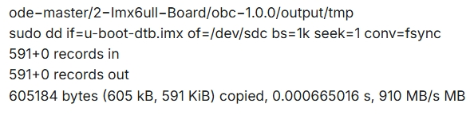 

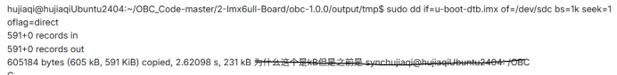 

 可能是什么缓存的问题

解决办法：把TF卡连到windows，格式化一下，然后连到ubuntu，他会默认挂载，解除挂载之后

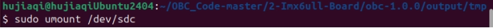 

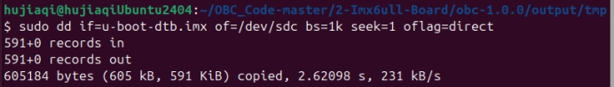 

能顺利烧进去uboot

 

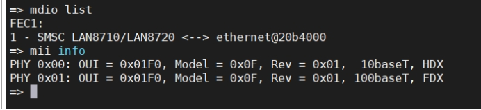 

说明

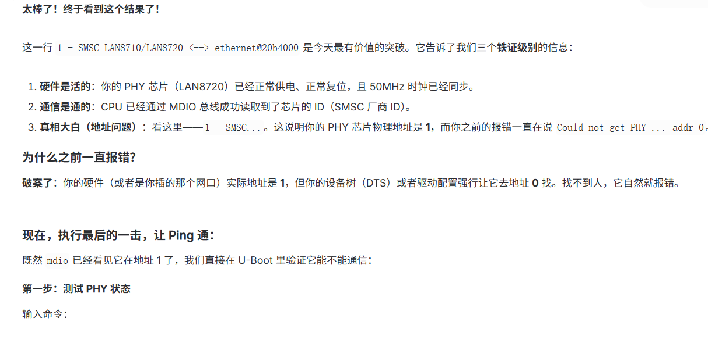 

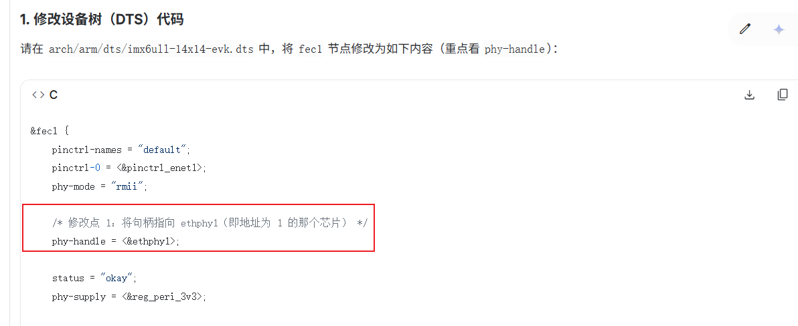、

 

问题：uboot上去之后如何进一步把fdt kernel弄上去，是通过upfdt，upk还是先pack再弄上去再unpack？？

Pack是针对单独的fdt和kernel，而不是把他们pack到一起，在obc1.0.0路径下运行 make pack_install 之后，在output/image里有pack好的文件

 

 

目前：已经把uboot烧到了TF卡上，现在需要设置板子TF卡启动

问题：虚拟机如何知道从哪个文件夹拿fdt kernel？？

tftpd-hpa里设置好一个文件夹

 

如何实现的obc1.0.0与sdk解耦开的？？

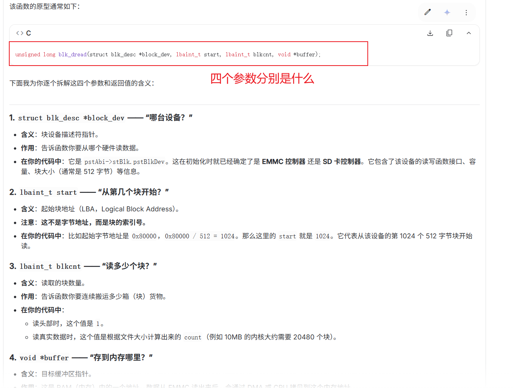 

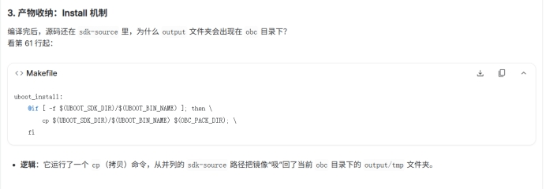 

总而言之，就是跳转到sdk里进行make,然后把结果cp回来

 

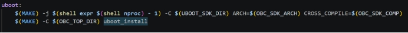 

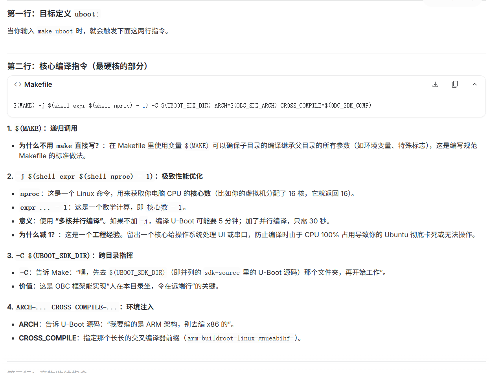 

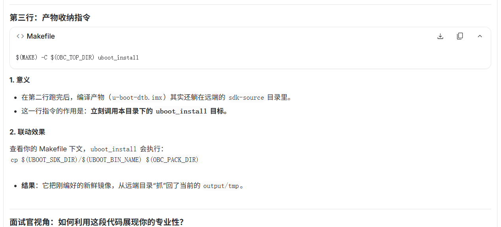 

 

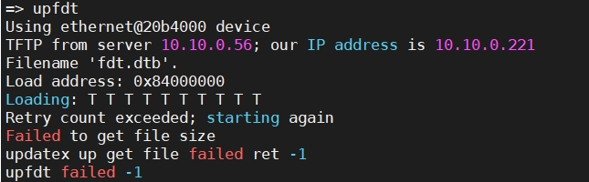 

一直出现时间超时报错问题？？

在/etc/default/tftpd-hpa下修改

TFTP_USERNAME="tftp"

TFTP_DIRECTORY="/home/hujiaqi/99-tftp" //指定为我的路径

TFTP_ADDRESS=":69" //udp端口

TFTP_OPTIONS="--secure -l -c"

然后sudo service tftpd-hpa restart 

 

网络配置：

sudo ifconfig ens33 10.10.0.56 netmask 255.255.0.0

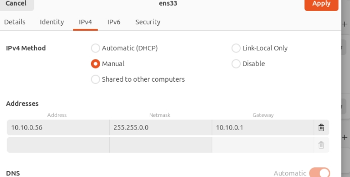 

 

 

 

 

板子启动代码的运行顺序：

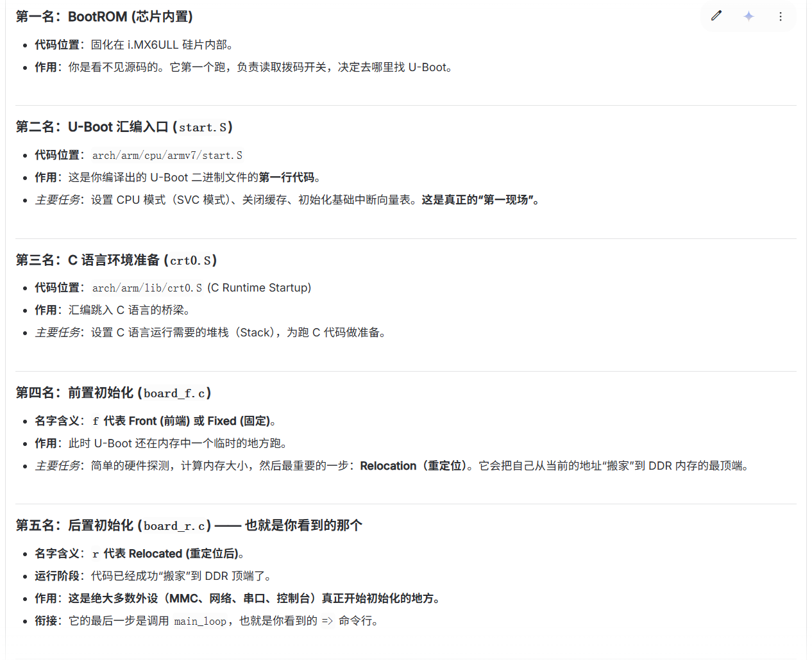 

Obc就是在board_r.c的最后加入的一个模块

在main_loop前面

 

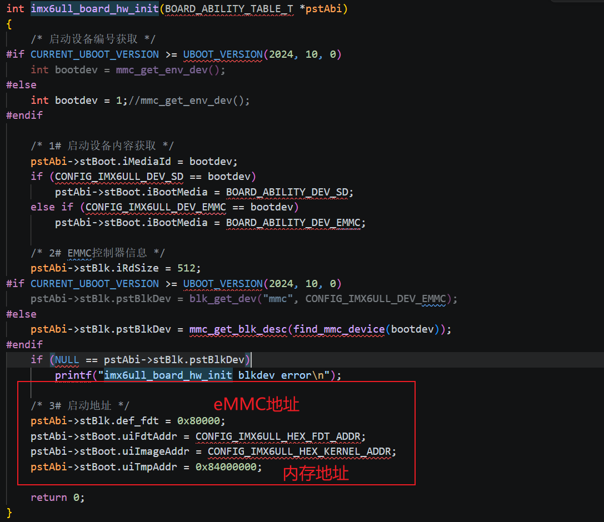 

TF卡执行upfdt之后，先把fdt搬到内存0x84000000,检测没问题之后再搬到0x80000的eMMC地址

 

 

 

解析设备树：

1. obc_blk_find_parts_node 递归查找obcpart
2. obc_blk_parse_fdt由上述节点查找下方的属性partitions
3. obc_blk_parse_partitions解析该节点 放到pstAbi->stBlk.stParts这个数组

 

 

 

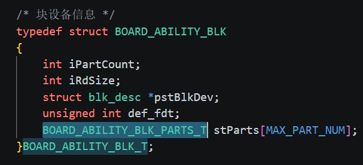 

该BOARD_ABILITY_BLK_PARTS_T数组是什么

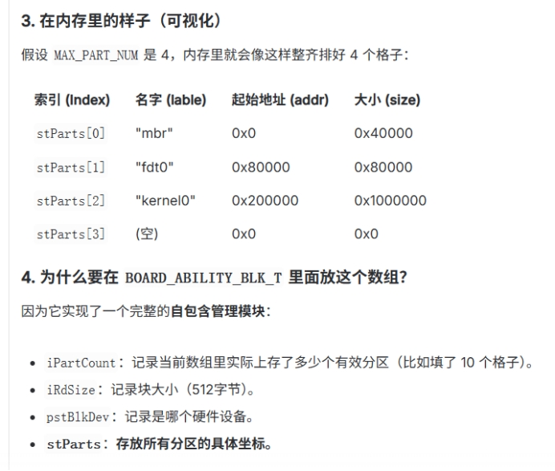 

 

烧录流程：TF

1.编译出uboot zImage fdt rootfs

2.Sudo umount /dev/sdb1  //解除挂载

3.sudo dd if=/dev/zero of=/dev/sdc bs=1M count=10 conv=fsync //清理头部 

4.sudo dd if=u-boot-dtb.imx of=/dev/sdc bs=1k seek=1 oflag=direct  //保证dd烧到TF卡里1K偏移 bs=1k -->  定义块大小，一块是1k  seek=1 ---> 从第一块开始，跳过了第0块

5.从TF卡启动，upb upfdt，然后切emmc启动

 

烧录流程：eMMC

1.make uboot

2.make pack_install

3.在板子上upb

 

为什么只有fdt和kernel用了pack的协议头？

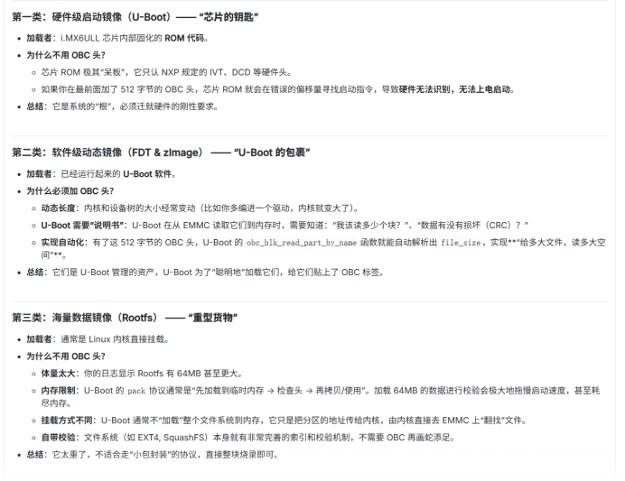 

 

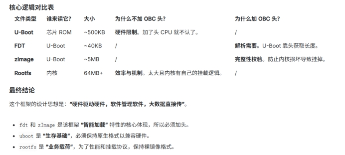 

 

 

 

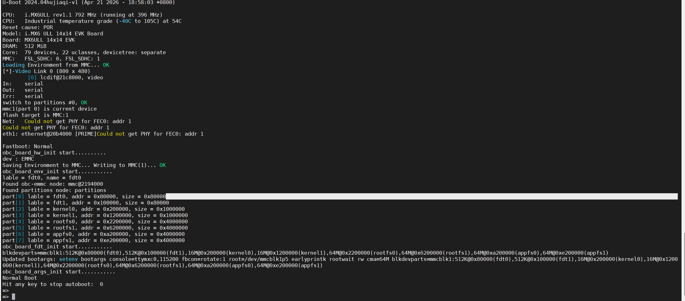 

Uboot启动日志

 

 注意：全局的结构体每次重启会被重置，只有eMMC里的数据不会丢失


PACK:

1.通过pack.c，数据前面加入协议头,magic，size,crc等

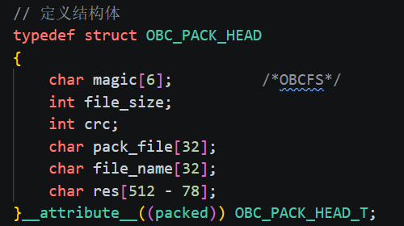

2.在cmd_updatex.c中把协议头解开，把数据解析出来（不涉及到unpack

3.写数据到eMMC时，把协议头也写进去

4.读数据的时候，通过把第一块blk跳过，达到直接读bin数据的功能


# 目前需要实现：

### 1.双分区升级

其实bsp工程师只需要往两个分区一起升级，主要实现崩溃分区切换即可，这是应用层做的，但是也可以研究一下

通过应用层直接IO文件操作 read write

tips:可以研究一下若文件很大，有2G的情况下，内存很小，该如何10M10M的往里写呢？？

### 2.崩溃三次自动切换分区启动

目前实现：

#### 1.通过sysflag切换分区

```
// 定义结构体
typedef struct OBC_SYSFLAG_HEAD
{
    char magic[8];          /*SYSFLAG*/
    int start_part;
}__attribute__((packed)) OBC_SYSFLAG_HEAD_T;
```

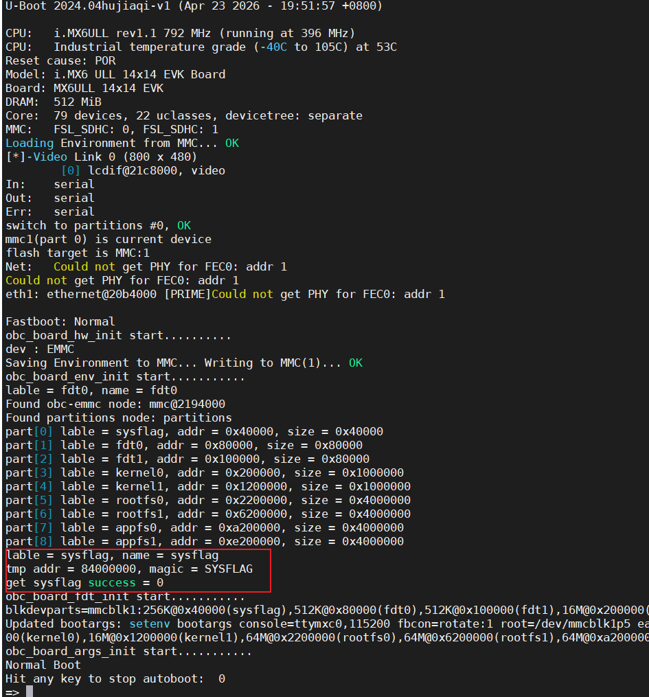

成功实现识别magic = SYSFLAG，success获得当前分区号

#### 2.手动模拟崩溃（已完成

思路：通过U_BOOT_CMD封装，实现set sysflag 0/1 （若目前是0 则set为1 然后reset之后下面打印为0则成功

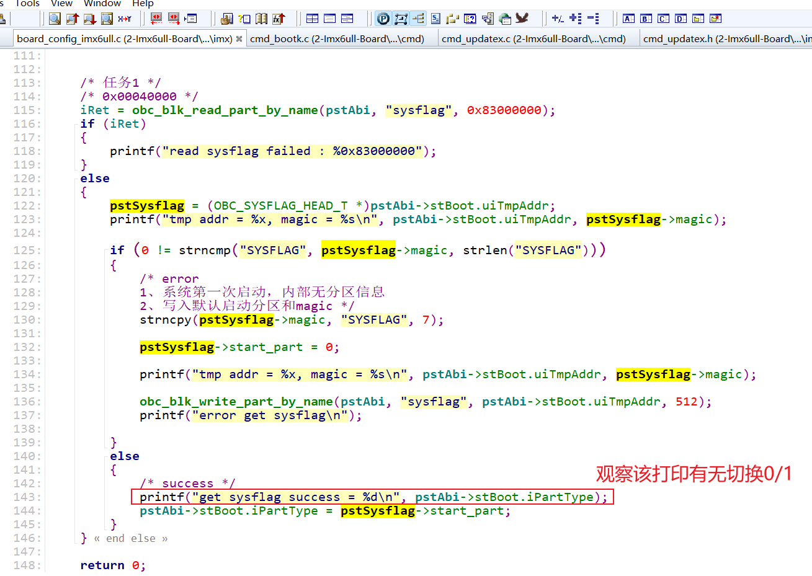

最好通过strncpy(pstSysflag->magic, "SYSFLAG", 7);赋值，通过sprintf很容易出错


目前问题：

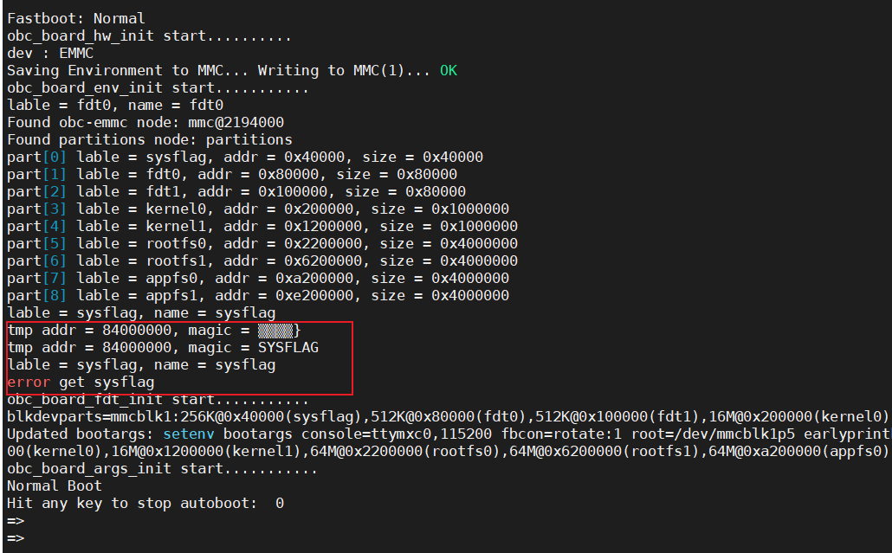

始终error get sysflag

修改地址也没用

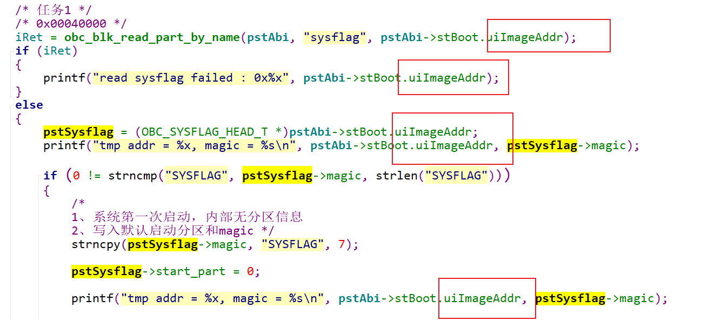

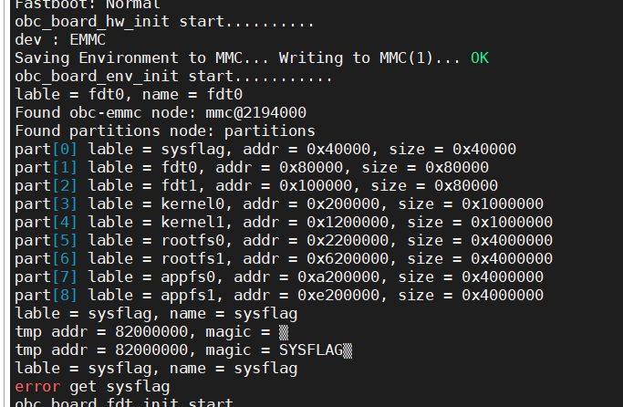


```
    /* 1# 读取一个块，获取数据头 */
    ulCnt = blk_dread(pstAbi->stBlk.pstBlkDev, start, 1, (void *)pstAbi->stBoot.uiTmpAddr);
    if (1 != ulCnt)
    {
        printf("get haed info error\n");
        return -1;
    }

    pstHead = (OBC_PACK_HEAD_T *)pstAbi->stBoot.uiTmpAddr;

    /* 计算读取的块数量 */
    count = pstHead->file_size / pstAbi->stBlk.iRdSize;
    if (0 != (pstHead->file_size % pstAbi->stBlk.iRdSize))
    {
        /* 不能被块大小整除就多读一个块 */
        count += 1;
    }

    /* 加载真实数据到内存 */
    ulCnt = blk_dread(pstAbi->stBlk.pstBlkDev, start + 1, count, (void *)addr);
    if (count != ulCnt)
    {
        printf("get partname info error\n");
        return -1;
    }
```

先把协议头读到uiTmpAddr，解析知道file_size，然后把真正的数据加载到addr

```
/* 第一种情况.fdt、kernel先取协议头 然后从协议头的下一块读数据*/
if(strcmp(pstParts[iPartsIndex].lable, "fdt0") == 0
        || strcmp(pstParts[iPartsIndex].lable, "fdt1") == 0
        || strcmp(pstParts[iPartsIndex].lable, "kernel0") == 0
        || strcmp(pstParts[iPartsIndex].lable, "kernel1") == 0){
       
 /*第二种情况. sysflag直接读数据 */      
    }else {//把emmc的sysflag写到内存里 
        ulCnt = blk_dread(pstAbi->stBlk.pstBlkDev, start , count, (void *)addr);
        if (count != ulCnt)
        {
            printf("get partname info error\n");
            return -1;
        }
    }
```

obc_blk_read_part_by_name函数修改（之前只适配fat、kernel加入协议头的情况，现新增read sysflag


##### 成功实现：

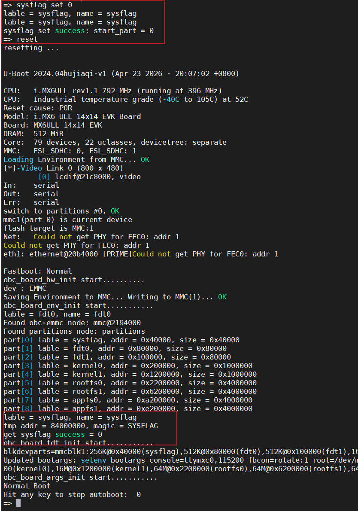


#### 3.根据切换的分区先实现自动切换kernel0/1 在cmd_bootk里（已实现

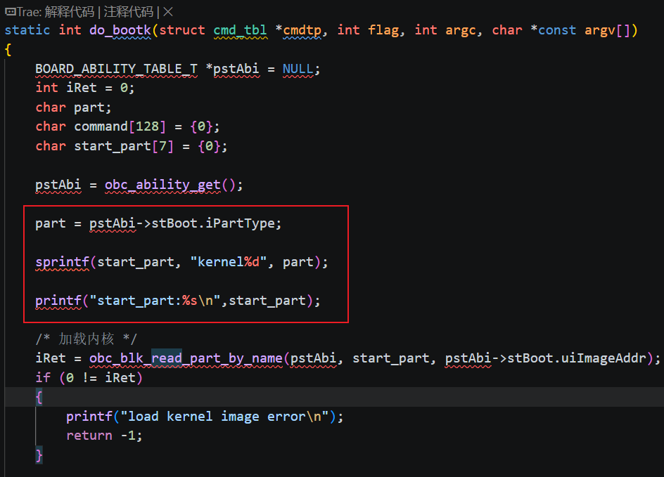

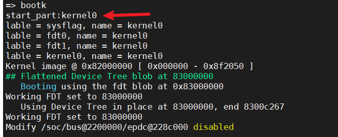

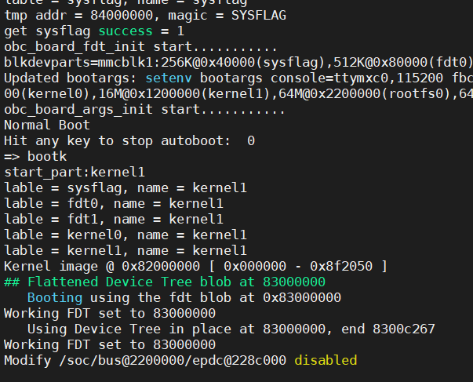

#### 4.实现三次崩溃切换分区（如图为0分区启动 三次计数之后转到1分区启动

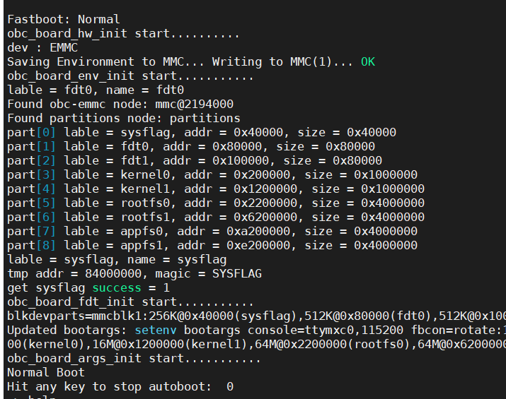

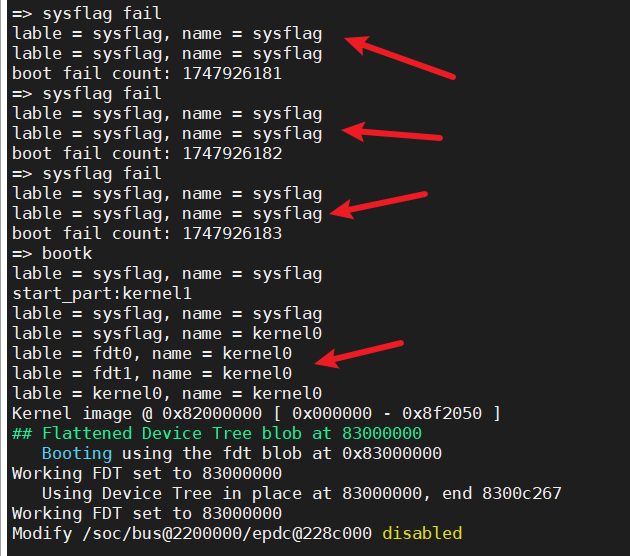

通过SYS结构体fail_count实现，逻辑实现在cmd_bootk.c中

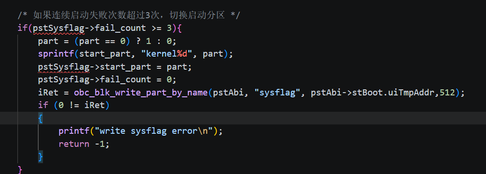

### 3.CRC32校验

#### 	1）.在pack.c代码中 （查表法

```
static unsigned int calculate_crc32(const unsigned char *data, unsigned int length)
{
    unsigned int crc = 0xFFFFFFFF;
    for (unsigned int i = 0; i < length; i++)
    {
        crc = crc32_table[(crc ^ data[i]) & 0xFF] ^ (crc >> 8);
    }
    return crc ^ 0xFFFFFFFF;
}
```

并重新编译pack工具

#### 	2）obc_blk.c代码中加入 （查表法 要确保表一致

```
crc32_table标准表= []...

unsigned int obc_crc32(const unsigned char *data, unsigned int length)
{
    unsigned int crc = 0xFFFFFFFF;
    for (unsigned int i = 0; i < length; i++)
    {
        crc = crc32_table[(crc ^ data[i]) & 0xFF] ^ (crc >> 8);
    }
    return crc ^ 0xFFFFFFFF;
}

/* Verify package CRC - returns 0 on success, -1 on mismatch */
int obc_verify_pack_crc(OBC_PACK_HEAD_T *pstHead, const unsigned char *data)
{
    unsigned int calc_crc = obc_crc32(data, pstHead->file_size);
    if (calc_crc != (unsigned int)pstHead->crc)
    {
        printf("CRC mismatch: calc=0x%08X, header=0x%08X\n", calc_crc, pstHead->crc);
        return -1;
    }
    printf("CRC check passed: 0x%08X\n", calc_crc);
    return 0;
}
```

#### 	3）在cmd_updatex.c中do_updatex_emmc_head_check调用上述函数 对比crc是否一致

```
    /* 2# CRC verification */
    if (0 != obc_verify_pack_crc(pstHead, data))
    {
        printf("CRC check failed, upgrade aborted\n");
        return -1;
    }

```

成功实现：

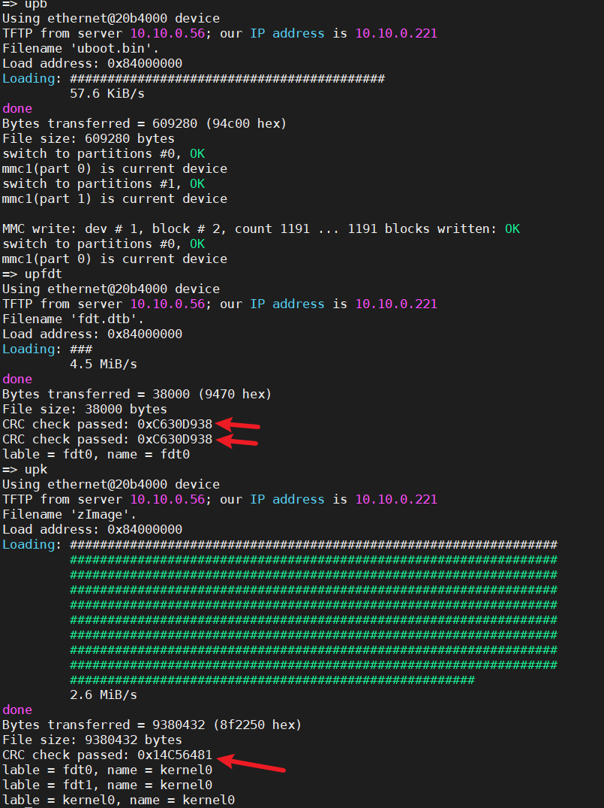

### 4.后续升级（有待实现

- **数字签名与验签**：用 **OpenSSL/libcrypto** 为升级包生成 ECDSA/RSA 签名，在 U-Boot 中集成验签逻辑，**公钥烧录在 eMMC 的不可写区域或 OTP**。
- **版本防回滚**：在私有协议头中增加 `version` 字段，U-Boot 启动时检查当前运行版本是否低于硬件记录的最低安全版本。


